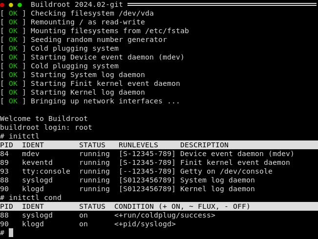

Finit Skeleton and Cookies
==========================

This is a [Buildroot external][5] that provides the [Finit init system][6].
See the blog post, below, for more information on the advantages of using
Finit in embedded Linux systems.

 - [Finit][2]
 - [Plugins][3]
 - [Skeleton][4]

For an example of how to use Finit in your project, see [br2-finit-demo][1],
you can even try out the latest build in Qemu yourself:

- **Downloads:** <https://github.com/troglobit/br2-finit-demo/releases/tag/latest>
- **Blog post:** <https://troglobit.com/post/2022-12-26-buildroot-demo-of-fastinit-finit/>

[1]: https://github.com/troglobit/br2-finit-demo
[2]: https://github.com/troglobit/finit/
[3]: https://github.com/troglobit/finit-plugins/
[4]: https://github.com/troglobit/finit-skel
[5]: https://nightly.buildroot.org/#outside-br-custom
[6]: https://troglobit.com/projects/finit/
